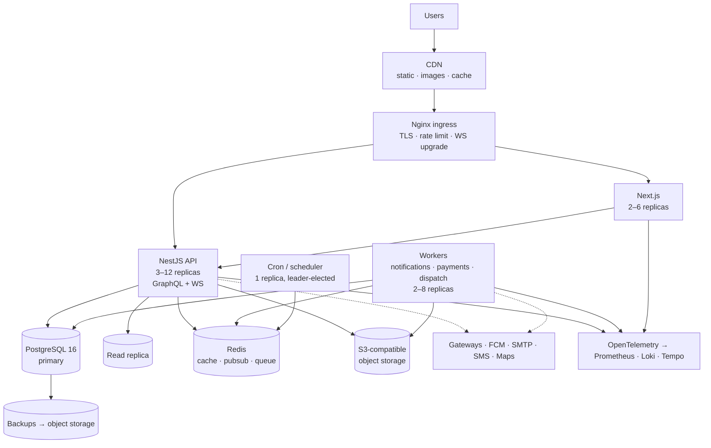
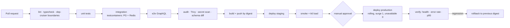

# D10 — Deployment Architecture

## Topology



**API and workers are the same image, different entrypoints** (`main.ts` vs
`worker.ts`). One build, one set of migrations, no drift between what the API
believes and what a worker believes — and workers scale on queue depth
independently of request traffic.

## Docker

Multi-stage, distroless runtime, non-root:

```dockerfile
# ---- deps
FROM oven/bun:1-alpine AS deps
WORKDIR /app
COPY package.json bun.lock ./
RUN bun install --frozen-lockfile

# ---- build
FROM deps AS build
COPY . .
RUN bunx prisma generate --schema ../database/prisma/schema \
 && bun run build \
 && bun install --frozen-lockfile --production

# ---- runtime
FROM gcr.io/distroless/nodejs22-debian12 AS runtime
WORKDIR /app
ENV NODE_ENV=production
COPY --from=build /app/node_modules ./node_modules
COPY --from=build /app/dist ./dist
COPY --from=build /app/schema.gql ./schema.gql
USER nonroot
EXPOSE 4000
CMD ["dist/main.js"]
```

Rules that keep this honest: the image runs as non-root, carries no shell in
production, is scanned by Trivy in CI with a hard fail on HIGH/CRITICAL, and is
tagged by immutable digest — never `:latest` in any environment.

`docker/` holds the compose stacks:

- `docker-compose.dev.yml` — Postgres 16 (with `pg_trgm`, `citext`, `unaccent`,
  `btree_gist`), Redis 7, MinIO, Mailpit, and the API in watch mode. One command
  to a working environment, which is the difference between a documented setup
  and a followed one.
- `docker-compose.test.yml` — ephemeral Postgres + Redis for CI.
- `docker-compose.prod.yml` — reference single-host deployment.

## Nginx

Terminates TLS 1.2/1.3, HTTP/2 (HTTP/3 optional), and:

- proxies `/graphql`, `/webhooks/*`, `/auth/*`, `/health/*` to the API and
  everything else to Next.js;
- upgrades WebSocket on `/graphql` and `/socket.io` with a 3600 s read timeout —
  the default 60 s silently kills long-lived subscriptions;
- **excludes `/webhooks/*` from body buffering and from rate limiting**, because
  signature verification needs the raw bytes and providers burst on retry;
- rate limits: 60 r/s per IP general, 10 r/s on `/auth`, `limit_conn 20`;
- sets HSTS (2 y, preload), `X-Content-Type-Options`, `Referrer-Policy`,
  `Permissions-Policy` and a CSP allowing only the CDN and the gateway domains;
- 20 MB body cap (uploads go direct to storage, so nothing legitimate is larger);
- real client IP from the proxy chain, so rate limiting and audit logs are not
  all attributed to the load balancer.

## CDN and object storage

Static assets and `_next/static` are immutable, hashed, cached a year. Images
are served through the CDN's image pipeline from the storage bucket; the
`FileAsset.variants` map holds the renditions a worker produced (thumb, md, and
WebP/AVIF), so the browser never resizes a 4 MB upload.

Buckets: `foodora-public` (menu photos, review media, CMS assets — CDN-fronted)
and `foodora-private` (rider documents, invoices, exports — presigned access
only, never public). Lifecycle rules expire orphaned `pending` uploads after 24 h
and transition invoices to cold storage after 90 days.

Uploads are direct-to-bucket by presigned POST (D5 §Upload), so an image never
occupies an API worker.

## Data stores

**PostgreSQL 16.** Primary + one streaming replica. Reads that tolerate a
second of lag — analytics, admin lists, exports — are routed to the replica by
an explicit `@ReadReplica()` marker on the query, never inferred, because a
silently-stale read in checkout is a bug that only appears under load. PgBouncer
in transaction mode sits in front; Prisma's `directUrl` bypasses it for
migrations, which need session-level state.

Tuning worth naming: `max_connections` sized to PgBouncer's pool rather than the
pod count, `shared_buffers` at 25% of RAM, `pg_stat_statements` on,
`log_min_duration_statement = 500ms`, autovacuum tightened on
`orders`, `order_events`, `notifications` and `rider_location_pings`.

**Redis 7.** Three logical databases so a cache flush cannot drop a job queue:
`0` cache (allkeys-lru, memory-capped), `1` BullMQ (noeviction — evicting a job
loses work), `2` pub/sub. Sentinel or managed failover; the cache is treated as
disposable and the queue is not.

## Environments

| | Local | Staging | Production |
| --- | --- | --- | --- |
| Data | seeded demo | anonymised subset | live |
| Payments | mock adapters | provider sandboxes | live keys |
| Notifications | Mailpit, logged SMS/push | real, to allowlisted addresses | real |
| Introspection | on | on | **off** |
| Feature flags | all on | matches production + candidates | controlled rollout |
| Replicas | 1 | 1–2 | autoscaled |

Configuration is environment variables validated by a Zod schema at boot — a
missing `JWT_PRIVATE_KEY` fails the pod, not the first request that needs it.
Secrets come from AWS Secrets Manager / Vault and are never in the image, the
repo, or a compose file. `docs/backend/.env.example` lists every key with its
shape and whether it is required.

## CI/CD



- **Migrations run as a pre-deploy Job**, not at pod start. Ten pods racing
  `migrate deploy` is a lock convoy; one Job that must succeed before the
  rollout begins is not.
- Migrations are **expand/contract**, so the previous image keeps working
  against the new schema for the length of a rollout — that is what makes
  rollback real rather than theoretical.
- The GraphQL schema diff fails the build on a breaking change unless the PR
  carries a `breaking-change` label, so the frontend cannot be broken silently.
- Rollback is redeploying the previous digest; a *data* rollback is a
  point-in-time restore, which is a different and much more expensive operation
  — hence the contract-phase discipline.

## Scaling

| Layer | Trigger | Range |
| --- | --- | --- |
| API | CPU 70% or p95 > 400 ms | 3 → 12 |
| Workers | queue depth > 1000 or oldest job > 60 s | 2 → 8 |
| Next.js | CPU 70% | 2 → 6 |
| Postgres | manual (vertical), replicas for read load | — |
| Redis | memory 75% | vertical |

Known bottleneck order, and the planned answer for each: (1) database
connections → PgBouncer; (2) read-heavy catalog queries → Redis response cache
+ replica reads; (3) search facets → the `SearchPort` swap to OpenSearch;
(4) notification fan-out → already queued and batched; (5) rider pings → already
Redis-first with buffered writes.

Lunch and dinner peaks are predictable, so the HPA carries a scheduled floor
around them rather than reacting after the queue has already built.

## Monitoring, logging, tracing

OpenTelemetry throughout: traces to Tempo, metrics to Prometheus, logs to Loki,
all correlated by `requestId` and `traceId` from `RequestContext`.

Golden signals per service, plus the domain metrics that actually predict an
outage being noticed by customers rather than by dashboards:

- orders placed / accepted / cancelled per minute, and the accept latency p95;
- payment success rate **per provider** (the first thing to break, and the
  easiest to miss because the rest of the system looks healthy);
- webhook lag and DLQ depth;
- dispatch: unassigned orders older than 5 minutes, offer acceptance rate;
- notification delivery rate per channel.

Alerts, routed by severity: p95 > 1 s for 5 min, error rate > 1%, payment
success < 95% for 10 min, DLQ non-empty, replication lag > 10 s, disk > 80%,
certificate expiring in 14 days.

Logs are structured JSON, one line per request plus domain events, with
`authorization`, `password`, `token`, `otp`, `card`, `phone` and `email`
redacted at the logger, not at the call site — redaction that depends on every
developer remembering is redaction that fails.

## Backup and disaster recovery

| | Target |
| --- | --- |
| RPO | 5 minutes |
| RTO | 1 hour |

- Continuous WAL archiving to object storage plus a nightly base backup; 30 days
  of point-in-time recovery.
- Object storage versioned and cross-region replicated.
- Redis is treated as **rebuildable, not backed up** — cache regenerates,
  queues are persisted with AOF `everysec`, and anything that must survive is in
  Postgres via the outbox. That is the reason the outbox exists.
- **Restores are rehearsed monthly** into a scratch environment, timed, and the
  result recorded. An untested backup is a hypothesis.
- Documented runbooks: primary failover, region loss, accidental mass delete
  (PITR to just before), payment provider outage (router failover), Redis loss
  (rebuild cache, replay outbox).

## Health checks

| Endpoint | Checks | Used by |
| --- | --- | --- |
| `/health/live` | process responsive | liveness probe — no dependencies, or a database blip restarts every pod |
| `/health/ready` | Postgres, Redis, migrations applied | readiness probe |
| `/health/deep` | + storage, gateways, FCM/SMTP/SMS | monitoring only, authenticated |

Graceful shutdown: stop accepting new connections, drain in-flight requests and
WebSocket subscriptions, let BullMQ finish active jobs, then exit — with
`terminationGracePeriodSeconds` set above the longest expected job so a deploy
does not kill a payment capture mid-flight.

## Production checklist

- [ ] Every secret in the secret manager; none in the image or repo
- [ ] `NODE_ENV=production`, introspection and playground off
- [ ] Migrations applied by the pre-deploy Job; rollback digest identified
- [ ] Production seeds (regions, RBAC, settings, providers, CMS collections) applied
- [ ] Payment providers switched to live keys; webhook URLs registered and verified
- [ ] FCM, SMTP and SMS credentials live; sender domains SPF/DKIM/DMARC verified
- [ ] TLS certificates with auto-renewal; HSTS preloaded
- [ ] Rate limits and CORS origins set for the real domains
- [ ] Backups running, and a restore rehearsed at least once
- [ ] Alerts routed to a real on-call rotation
- [ ] Load test passed at 3× expected peak
- [ ] Runbooks written and linked from the alerts
