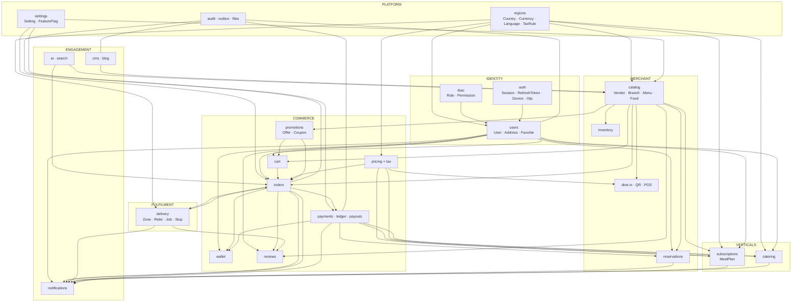
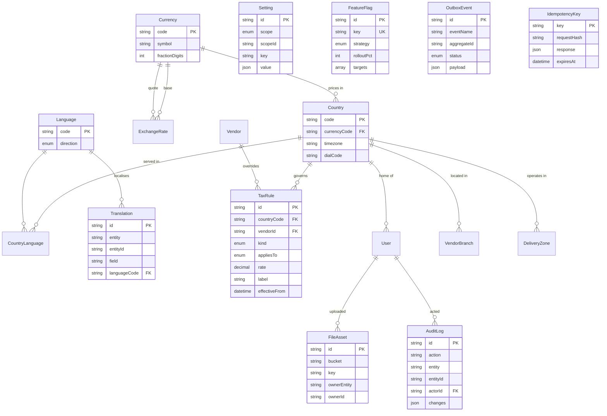
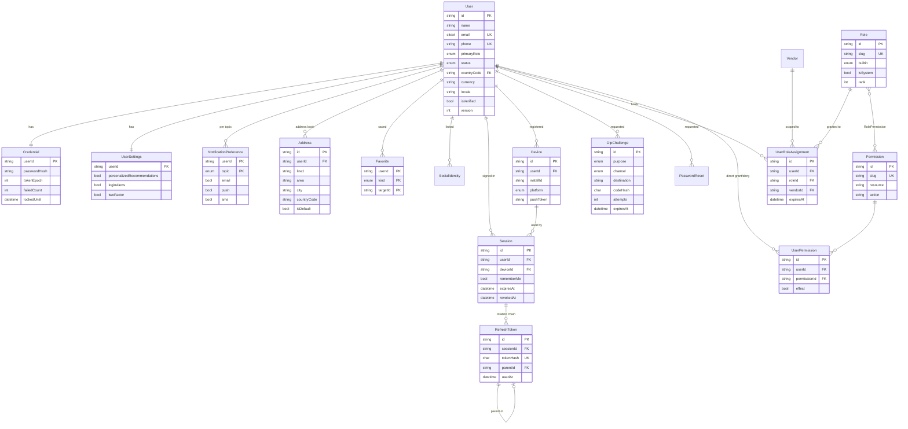
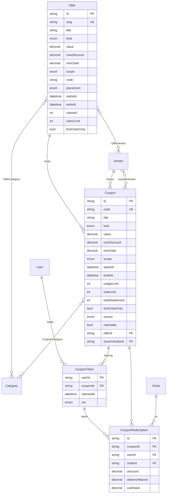
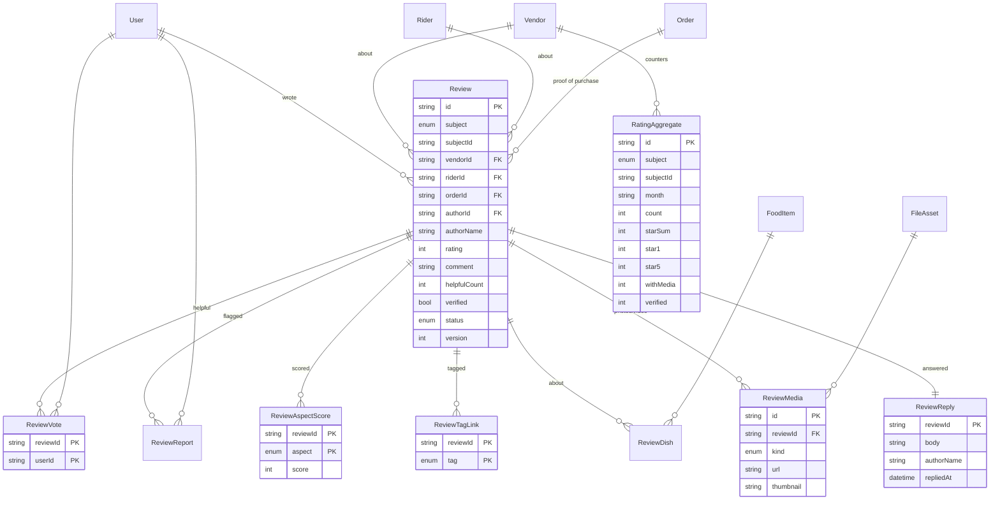
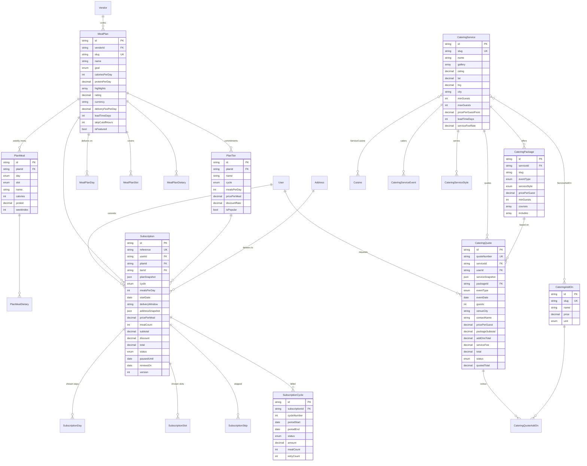
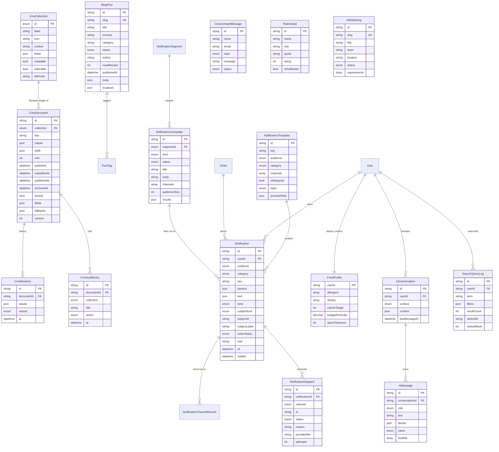

# D3 — ER Diagram

169 models in one diagram is a wall, not a document. So: one **context map**
showing how the bounded contexts relate, then one ER diagram per context with
every relationship in it. Cardinality notation is Mermaid's
(`||--o{` = one-to-many, `||--||` = one-to-one, `}o--o{` = many-to-many).

Join tables are shown where they carry meaning and collapsed to `}o--o{` where
they are pure link rows.

## Context map



## 1. Platform & reference data



## 2. Identity, RBAC and auth



## 3. Catalog — brand, branch, menu, dish

```mermaid
erDiagram
  User ||--o{ Vendor : "owns"
  Vendor ||--o{ VendorBranch : "locations"
  Vendor ||--o{ VendorStaff : "employs"
  Vendor }o--o{ Cuisine : "VendorCuisine"
  Vendor ||--o{ VendorDietary : "tags"
  VendorBranch ||--o{ BranchHour : "weekly grid"
  VendorBranch ||--o{ BranchClosure : "exceptions"
  VendorBranch }o--o{ Amenity : "BranchAmenity"
  DeliveryZone ||--o{ VendorBranch : "dispatches"
  Vendor ||--o{ Menu : "publishes"
  Menu ||--o{ MenuSection : "sections"
  Vendor ||--o{ MenuSection : "denormalised"
  MenuSection ||--o{ FoodItem : "dishes"
  Vendor ||--o{ FoodItem : "denormalised"
  FoodItem ||--o{ FoodOptionGroup : "customisation"
  FoodOptionGroup ||--o{ FoodOption : "choices"
  FoodItem ||--|| FoodNutrition : "macros"
  FoodItem ||--o{ FoodDietary : "tags"
  FoodItem ||--o{ FoodAllergen : "warnings"
  FoodItem }o--o{ Category : "FoodCategory"
  Category ||--o{ CategoryKeyword : "search terms"
  Category ||--o{ Category : "parent of"
  FoodItem ||--o| InventoryItem : "stock"
  Vendor ||--o{ InventoryItem : "tracks"
  InventoryItem ||--o{ StockMovement : "ledger"

  Cuisine { string id PK  string slug UK  string name  string emoji }
  Category { string id PK  string slug UK  string name  int sort  string parentId FK }
  Vendor { string id PK  string slug UK  enum type  string ownerId FK  string name  int priceLevel  decimal rating  int reviewCount  string currency  enum status  decimal commissionRate  int version }
  VendorBranch { string id PK  string vendorId FK  bool isPrimary  decimal lat  decimal lng  string city  string countryCode FK  string timezone  int etaMinMinutes  int etaMaxMinutes  decimal deliveryFee  decimal minOrder  decimal freeDeliveryOver  bool acceptingOrders  string zoneId FK }
  BranchHour { string id PK  string branchId FK  enum weekday  string openTime  string closeTime  bool overnight }
  Menu { string id PK  string vendorId FK  enum kind  bool isDefault }
  MenuSection { string id PK  string menuId FK  string vendorId FK  string name  int sort }
  FoodItem { string id PK  string slug UK  string vendorId FK  string sectionId FK  string name  decimal price  decimal compareAtPrice  int spicyLevel  int calories  decimal rating  bool isPopular  bool isAvailable  int version }
  FoodOptionGroup { string id PK  string foodId FK  string name  bool required  int min  int max }
  FoodOption { string id PK  string groupId FK  string name  decimal priceDelta }
  FoodNutrition { string foodId PK  int calories  decimal protein  decimal carbs  decimal fat  string source }
  InventoryItem { string id PK  string vendorId FK  string foodId FK UK  decimal onHand  decimal reserved  decimal lowStockAt  bool trackStock }
  StockMovement { string id PK  string itemId FK  enum kind  decimal quantity  decimal balance  string refId }
  Amenity { string id PK  string slug UK  string name  string group }
  VendorStaff { string id PK  string vendorId FK  string userId FK  string jobTitle  string pinHash }
```

## 4. Cart and orders

```mermaid
erDiagram
  User ||--o{ Cart : "holds"
  Vendor ||--o{ Cart : "single-vendor"
  VendorBranch ||--o{ Cart : ""
  Address ||--o{ Cart : "deliver to"
  Coupon ||--o{ Cart : "applied"
  Cart ||--o{ CartItem : "lines"
  CartItem ||--o{ CartItemOption : "selections"
  FoodOption ||--o{ CartItemOption : ""
  FoodItem ||--o{ CartItem : ""

  User ||--o{ Order : "placed"
  Vendor ||--o{ Order : "fulfils"
  VendorBranch ||--o{ Order : ""
  Rider ||--o{ Order : "delivers"
  Coupon ||--o{ Order : "discounted"
  Order ||--o{ OrderItem : "lines"
  OrderItem ||--o{ OrderItemOption : "selections"
  FoodItem ||--o{ OrderItem : ""
  Order ||--o{ OrderEvent : "lifecycle log"
  Order ||--o{ OrderRiderDecline : "declined by"
  Rider ||--o{ OrderRiderDecline : ""
  Order ||--|| Invoice : "issued"
  Order ||--o{ RefundRequest : "claimed"
  Order ||--o{ PaymentIntent : "paid by"
  Order ||--o{ CouponRedemption : "spent on"
  Order ||--o{ Review : "reviewed by"
  Order ||--o{ DeliveryJobOrder : "carried on"

  Cart { string id PK  string userId FK  string guestKey  string vendorId FK  enum fulfillment  string addressId FK  decimal tip  string couponId FK  int version }
  CartItem { string id PK  string cartId FK  string foodId FK  decimal basePrice  decimal unitPrice  int quantity }
  CartItemOption { string cartItemId PK  string optionId PK  string groupId  decimal priceDelta }
  Order { string id PK  string orderNumber UK  string userId FK  string vendorId FK  string branchId FK  json vendorSnapshot  json addressSnapshot  enum fulfillment  datetime scheduledFor  enum paymentMethod  enum paymentStatus  string currency  decimal subtotal  decimal deliveryFee  decimal discount  decimal tax  decimal taxRate  decimal tip  decimal total  decimal commission  enum status  datetime placedAt  datetime estimatedDeliveryAt  int prepMinutes  datetime promisedReadyAt  int delayMinutes  enum cancelReason  json riderSnapshot  string riderId FK  enum assignment  char otpHash  int otpAttempts  enum refundStatus  int rating  int version }
  OrderItem { string id PK  string orderId FK  string foodId FK  string lineKey  decimal unitPrice  int quantity  decimal lineTotal }
  OrderEvent { string id PK  string orderId FK  enum status  datetime at  enum actor  string actorId  string note  json meta }
  OrderRiderDecline { string orderId PK  string riderId PK  datetime declinedAt }
  Invoice { string id PK  string orderId FK UK  string invoiceNumber UK  string countryCode  decimal tax  decimal total  json sellerDetails }
  RefundRequest { string id PK  string orderId FK  enum status  decimal amount  enum reason  string decidedById }
  NumberSequence { string scope PK  bigint current }
```

## 5. Payments, ledger and settlement

```mermaid
erDiagram
  PaymentProvider ||--o{ PaymentIntent : "processes"
  PaymentProvider ||--o{ PaymentTransaction : ""
  PaymentProvider ||--o{ Refund : ""
  PaymentProvider ||--o{ PaymentWebhookEvent : "calls back"
  PaymentProvider ||--o{ SavedPaymentMethod : "tokenises"
  PaymentProvider ||--o{ Payout : "disburses"
  Order ||--o{ PaymentIntent : ""
  SubscriptionCycle ||--o| PaymentIntent : "charges"
  PaymentIntent ||--o{ PaymentTransaction : "attempts"
  PaymentIntent ||--o{ Refund : "reverses"
  Order ||--o{ Refund : ""
  RefundRequest ||--o{ Refund : "authorises"
  User ||--o{ SavedPaymentMethod : "saved"

  User ||--|| Wallet : "has"
  Wallet ||--o{ WalletTransaction : "ledger"
  Order ||--o{ WalletTransaction : "paid/refunded"

  LedgerAccount ||--o{ LedgerEntry : "double entry"
  Order ||--o{ LedgerEntry : "generated"

  Vendor ||--o{ PayoutAccount : "banks with"
  Rider  ||--o{ PayoutAccount : ""
  PayoutAccount ||--o{ Payout : "paid into"
  Vendor ||--o{ Payout : "settled"
  Rider  ||--o{ Payout : ""
  MembershipPlan ||--o{ VendorMembership : "subscribed"
  Vendor ||--o{ VendorMembership : ""

  PaymentProvider { string id PK  enum kind UK  array countryCodes  array capabilities  json credentialRefs  int priority  bool isEnabled  decimal feeRate }
  PaymentIntent { string id PK  string orderId FK  string providerId FK  enum method  enum status  decimal amount  decimal capturedAmount  decimal refundedAmount  string providerRef  string clientRef UK  int attempt  int version }
  PaymentTransaction { string id PK  string intentId FK  enum kind  bool success  json rawPayload  int latencyMs }
  Refund { string id PK  string intentId FK  decimal amount  bool isPartial  enum reason  enum status  bool toWallet }
  PaymentWebhookEvent { string id PK  string providerId FK  string eventId UK  enum status  bool signatureValid  json payload }
  Wallet { string id PK  string userId FK UK  string currency  decimal balance  decimal pending  int version }
  WalletTransaction { string id PK  string walletId FK  enum type  decimal amount  decimal balanceAfter  string orderNumber }
  LedgerAccount { string id PK  enum kind  string ownerId  string currency  decimal balance }
  LedgerEntry { string id PK  string accountId FK  string transactionRef  string eventName  decimal amount  string orderId FK }
  Payout { string id PK  string reference UK  string vendorId FK  string riderId FK  enum status  decimal grossAmount  decimal commission  decimal netAmount  datetime periodEnd }
  CommissionRule { string id PK  string vendorId  enum vendorType  string countryCode  decimal rate  int priority }
  MembershipPlan { string id PK  string slug UK  enum interval  decimal price  array features }
  VendorMembership { string id PK  string vendorId FK  string planId FK  enum status  datetime currentPeriodEnd }
```

## 6. Promotions



## 7. Reviews



## 8. Delivery

```mermaid
erDiagram
  Country ||--o{ DeliveryZone : ""
  DeliveryZone ||--o{ ZoneArea : "covers"
  DeliveryZone ||--o{ Rider : "home pool"
  DeliveryZone ||--o{ DeliveryJob : "priced by"
  User ||--o| Rider : "account"
  Rider ||--o{ RiderDocument : "verified by"
  Rider ||--o{ RiderShift : "worked"
  Rider ||--o{ DeliveryJob : "assigned"
  Rider ||--o{ JobOffer : "offered"
  DeliveryJob ||--o{ JobOffer : "dispatched"
  DeliveryJob ||--o{ DeliveryJobOrder : "carries"
  Order ||--o{ DeliveryJobOrder : ""
  DeliveryJob ||--o{ DeliveryStop : "route"
  DeliveryJob ||--o{ RiderLocationPing : "breadcrumbs"
  Rider ||--o{ RiderLocationPing : ""
  Rider ||--o{ RiderLedgerEntry : "money"
  DeliveryJob ||--o{ RiderLedgerEntry : "earned on"
  Rider ||--o{ RiderRemittance : "hands back"
  Rider ||--o{ RiderWithdrawal : "cashes out"

  DeliveryZone { string id PK  string name  string city  string countryCode FK  string currency  decimal lat  decimal lng  json boundary  decimal baseFare  decimal perKm  decimal peakMultiplier  array peakHours  decimal batchBonus  decimal cashLimit  decimal minWithdrawal }
  Rider { string id PK  string userId FK UK  string name  string phone  enum vehicle  string plate  string zoneId FK  enum status  decimal rating  int trips  decimal acceptanceRate  decimal onTimeRate  bool isOnShift  decimal lastLat  decimal lastLng  int version }
  RiderDocument { string id PK  string riderId FK  enum kind  enum status  string fileId  datetime expiresAt }
  DeliveryJob { string id PK  string jobNumber UK  string riderId FK  string zoneId FK  enum status  decimal distanceKm  int estimatedMinutes  decimal baseFare  decimal distanceFee  decimal peakBonus  decimal batchBonus  decimal tip  decimal payoutTotal  decimal cashToCollect  datetime offeredAt  datetime expiresAt  datetime acceptedAt  int version }
  DeliveryJobOrder { string jobId PK  string orderId PK  string orderNumber  string vendorName  string customerName  int itemCount  decimal orderTotal  enum paymentMethod  decimal cashDue }
  DeliveryStop { string id PK  string jobId FK  enum kind  string orderId  string name  string address  decimal lat  decimal lng  int sequence  decimal legKm  int legMinutes  char otpHash  decimal cashDue  datetime completedAt }
  JobOffer { string id PK  string jobId FK  string riderId FK  enum outcome  decimal score  datetime expiresAt }
  RiderLedgerEntry { string id PK  string riderId FK  enum type  decimal amount  string reference  string jobId FK  bool isSettled  bool affectsCash }
  RiderRemittance { string id PK  string riderId FK  decimal amount  enum method  string reference  datetime occurredAt }
  RiderWithdrawal { string id PK  string riderId FK  decimal amount  enum status  string reference }
```

## 9. Reservations and dine-in

```mermaid
erDiagram
  Vendor ||--|| BookingPolicy : "rules"
  BookingPolicy ||--o{ BookingPolicyZone : "sells online"
  Vendor ||--o{ RestaurantTable : "floor plan"
  Vendor ||--o{ Reservation : "books"
  User ||--o{ Reservation : "made"
  Reservation }o--o{ RestaurantTable : "ReservationTable"

  Vendor ||--|| QrMenuConfig : "QR settings"
  RestaurantTable ||--o{ DineInSession : "sitting"
  DineInSession ||--o{ DineInRound : "rounds"
  DineInRound ||--o{ DineInRoundItem : "lines"
  FoodItem ||--o{ DineInRoundItem : ""
  DineInSession ||--o{ ServiceRequest : "calls"

  Vendor ||--o{ PosShift : "till sessions"
  Vendor ||--o{ PosHeldTicket : "parked"
  RestaurantTable ||--o{ PosHeldTicket : ""
  PosHeldTicket ||--o{ PosHeldTicketLine : "lines"
  Vendor ||--o{ PosSale : "sold"
  PosShift ||--o{ PosSale : "during"
  User ||--o{ PosSale : "cashier"
  PosSale ||--o{ PosSaleItem : "lines"
  FoodItem ||--o{ PosSaleItem : ""

  BookingPolicy { string id PK  string vendorId FK UK  int turnMinutes  int largePartyTurnMinutes  int largePartyFrom  int slotMinutes  int minPartySize  int maxPartySize  int lastSeatingBeforeClose  int leadTimeMinutes  int advanceDays  decimal depositPerGuest  int depositFrom  int cancelCutoffHours  bool autoConfirm }
  RestaurantTable { string id PK  string vendorId FK  string label  int seats  enum zone  bool isActive }
  Reservation { string id PK  string reference UK  string userId FK  string vendorId FK  json venueSnapshot  date date  string time  datetime startsAt  datetime endsAt  int durationMinutes  int partySize  array tableLabels  enum zone  enum occasion  string guestName  string guestPhone  enum status  decimal depositAmount  int version }
  QrMenuConfig { string id PK  string vendorId FK UK  string welcomeMessage  bool ordering  bool waiterCall  bool billRequest  decimal serviceChargeRate  bool askGuestName }
  DineInSession { string id PK  string vendorId  string tableId FK  string guestKey  enum status  decimal serviceChargeRate  decimal taxRate  datetime openedAt  string posSaleId UK }
  DineInRound { string id PK  string sessionId FK  int roundNumber  string note  datetime sentAt  datetime servedAt }
  ServiceRequest { string id PK  string sessionId FK  enum kind  datetime requestedAt  datetime resolvedAt }
  PosShift { string id PK  string vendorId FK  string cashierName  decimal openingFloat  decimal closingCount  decimal expectedCash  datetime closedAt }
  PosSale { string id PK  string saleNumber UK  string vendorId FK  string shiftId FK  enum orderType  string tableLabel  decimal subtotal  decimal discount  decimal tax  decimal total  enum method  decimal tendered  decimal change  string cashierName  datetime soldAt }
```

## 10. Subscriptions (meal plans) and catering



## 11. CMS, content, notifications, AI and search



## Relationship summary

| From | To | Kind | Note |
| --- | --- | --- | --- |
| User → Vendor | owner | 1:N optional | `ownerId` powers "my restaurant" |
| Vendor → VendorBranch | locations | 1:N, exactly one primary | the brand/location split (D2) |
| VendorBranch → DeliveryZone | dispatch | N:1 optional | fare rules and rider pool |
| Vendor → Menu → MenuSection → FoodItem | catalog | 1:N chain | `vendorId` denormalised onto the last two |
| FoodItem → FoodOptionGroup → FoodOption | customisation | 1:N chain | |
| Cart → Order | checkout | conversion, not FK | the cart is consumed, snapshots are frozen |
| Order → OrderEvent | lifecycle | 1:N append-only | the only honest timeline |
| Order → PaymentIntent | collection | 1:N | a retry is a new intent |
| PaymentIntent → Refund | reversal | 1:N | partial refunds are rows |
| Order ↔ DeliveryJob | fulfilment | M:N via `DeliveryJobOrder` | batching is why it is M:N |
| DeliveryJob → DeliveryStop | route | 1:N ordered by `sequence` | |
| Coupon → CouponClaim → CouponRedemption | promotion | 1:N chain | rule / holding / spending, kept apart |
| Offer → Coupon | mint | 1:N optional | a campaign coupon inherits its terms |
| Order → Review | proof of purchase | 1:N, unique per subject | one order, one vendor review, one rider review |
| Review → ReviewReply | answer | 1:1 | unique on `reviewId` |
| Reservation ↔ RestaurantTable | seating | M:N | a big party spans two tables |
| MealPlan → PlanTier / PlanMeal | product | 1:N | tiers priced, meals rotate |
| Subscription → SubscriptionCycle | billing | 1:N | each renewal is auditable |
| CateringService → CateringPackage / CateringQuote | vertical | 1:N | |
| CmsCollection → CmsDocument → CmsRevision | content | 1:N chain | schema / values / history |
| Notification → NotificationDispatch | delivery | 1:N | one row per channel attempt |
| LedgerAccount → LedgerEntry | money | 1:N double-entry | Σ per `transactionRef` = 0 |
