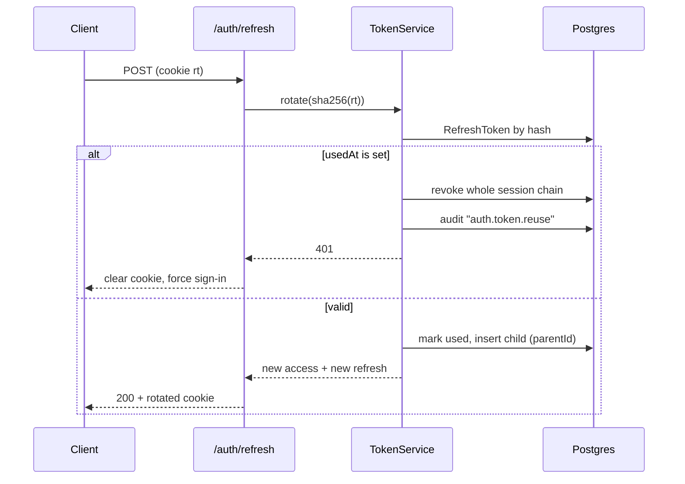

# D6 — Authentication Architecture

Serves `services/auth.ts` unchanged: same `Promise<Result<User>>` signatures,
same i18n error keys (`errors.invalidCredentials`, `errors.emailTaken`,
`errors.invalidOtp`). What changes is that the tokens become real.

## Token model

| Token | Lifetime | Storage | Contents |
| --- | --- | --- | --- |
| Access | 15 min | memory (client), never persisted | `sub`, `sid`, `role`, `permHash`, `country`, `currency`, `locale`, `epoch` |
| Refresh | 30 d (7 d without "remember me") | `httpOnly; Secure; SameSite=Lax` cookie, path `/auth` | opaque 256-bit random; only its SHA-256 is stored |

**Access tokens are RS256**, signed with a rotating key pair; the public JWKS is
served at `/.well-known/jwks.json` so a future service can verify without a
shared secret. Key rotation is by `kid`, with the previous key honoured for one
access-token lifetime.

They are deliberately **stateless** — no database read per request. The
consequence is honest: a revoked session's access token stays valid for at most
15 minutes. Two mitigations, no pretending:

- `epoch` in the token is compared against `Credential.tokenEpoch`, cached in
  Redis. A password change bumps it and kills every access token instantly.
- A Redis `revoked:<sid>` set, checked only by mutations that move money or
  change access, so the expensive check is on the 1% of requests that warrant
  it.

**Refresh tokens are opaque, not JWTs.** There is nothing to read in them, they
are revocable by definition, and a stolen one is detectable — none of which is
true of a self-contained refresh JWT.

## Refresh token rotation

Every refresh mints a new token and marks the old one `usedAt`. Presenting an
already-used token means the chain leaked:

```
POST /auth/refresh  (cookie: rt=<opaque>)
  hash = sha256(rt)
  token = RefreshToken.findUnique({ tokenHash: hash })

  ├── not found              → 401, clear cookie
  ├── revokedAt != null      → 401
  ├── expiresAt < now        → 401
  ├── usedAt != null         → REUSE DETECTED
  │                            revoke every token in the session
  │                            revoke the session ('rotation-reuse')
  │                            audit + notify the account owner
  │                            401
  └── valid                  → mark usedAt, mint child (parentId = token.id),
                               rotate the cookie, issue a new access token
```

The `parentId` chain is what makes reuse detectable rather than merely
suspected. Rotation is serialised per session with a short Redis lock, so two
concurrent refreshes from the same tab do not race into a false positive; the
loser waits and receives the winner's token.

## Sign-in methods

**Email + password.** Argon2id (`m=19456 KiB, t=2, p=1`), tuned to ~250 ms on
the target instance. Progressive lockout on `Credential.failedCount`: 5 attempts
→ 1 min, 8 → 15 min, 12 → 1 hour, all recorded in `LoginAttempt`. The response
time is constant whether or not the account exists — a dummy hash is verified on
a miss — and the error is always `errors.invalidCredentials`, never
"no such account".

**Phone OTP.** 6 digits, hashed with SHA-256 + a server pepper, 5-minute expiry,
5 attempts, single-use (`consumedAt`). Rate limited three ways: 1 per 60 s per
destination, 5 per hour per destination, 20 per hour per IP. `requestOtp` always
returns success regardless of whether the number is known — the prototype's
behaviour, and the correct one.

**Social — Google, Apple, Facebook.** Authorization Code + PKCE, never implicit.
The server verifies the ID token against the provider's JWKS and checks `iss`,
`aud`, `exp` and `nonce`; a token the client merely *claims* is valid is never
trusted. Account linking:

```
verified provider identity
  ├── SocialIdentity(provider, sub) exists       → sign in
  ├── a User with that VERIFIED email exists     → link, then sign in
  ├── a User with that UNVERIFIED email exists   → refuse; require e-mail
  │                                                verification first
  │                                                (blocks the classic takeover)
  └── nothing                                    → create the account, mark the
                                                   email verified if the
                                                   provider asserted it
```

Apple is special-cased where it must be: the name arrives only on first
authorization, and `@privaterelay.appleid.com` addresses are real deliverable
addresses that must not be treated as disposable.

## Session and device management

A `Session` is one sign-in on one `Device`. The account's security screen lists
them with location, platform, last-seen and a "sign out" action; "sign out
everywhere" revokes all but the current one. `Device` doubles as the FCM
registration record, because a device's push token and its session are the same
fact and keeping two tables would let them disagree.

`loginAlerts` (from `UserSettings`) sends a notification when a session is
created from a device that has never been seen — the check is
`(userId, installId)` plus a coarse geo change, not user-agent string equality,
which would fire on every browser update.

## Two-factor

`UserSettings.twoFactor` gates a second step after a correct password: an
`OtpChallenge` with `purpose: TWO_FACTOR` to the verified phone. The
intermediate state is a short-lived (`5 min`), single-purpose
`mfa_pending` token — **not** an access token with reduced scope, because a
half-authenticated access token inevitably gets accepted somewhere it should
not be. TOTP is the planned successor; the `OtpChallenge` shape already carries
it.

## RBAC and PBAC

RBAC is the coarse gate, PBAC the fine one, and both resolve to one set:

```
effective = ⋃ role.permissions for every non-expired UserRoleAssignment
          ∪ { p : UserPermission(effect = true)  }
          − { p : UserPermission(effect = false) }     ← denial always wins
```

Scoping matters as much as the set. A `UserRoleAssignment` may carry a
`vendorId`, which is what makes "manager of *this* restaurant" expressible
without a parallel permission system. `VendorScopeGuard` reads the scope from
the actor and the target from the arguments, and the repository applies it —
so a scoped actor querying outside their scope gets an empty result, not a
filtered-after-the-fact one.

Resolution is cached in Redis at `perm:<userId>:<epoch>` (5 min TTL); the epoch
is bumped by any role or permission change, so invalidation is a write to one
counter rather than a fan-out.

The frontend contract is unchanged: `User.role` is the primary role string and
`User.permissions` is the resolved slug array.

## Delivery OTP — a different threat model

The handoff code on `Order.otpHash` / `DeliveryStop.otpHash` is **not** an
authentication factor, and treating it like one is the mistake to avoid. It is a
proof-of-delivery token, and the rider is the party it defends against. So:

- Issued at placement, hashed at rest.
- **Revealed to the customer only** — and only once `status = arrived`, exactly
  as Phase C does.
- The rider **submits** it; the server compares. The rider app never receives
  it, at any status.
- 3 attempts (`OTP_MAX_ATTEMPTS`), then the rider is locked out of that stop and
  support is notified — the failure path is a human one.

## Password reset

Single-use token (32 bytes), SHA-256 at rest, 30-minute expiry, invalidated by
any successful sign-in. `requestPasswordReset` always returns success — no
account enumeration, matching the prototype. Completing a reset bumps
`tokenEpoch`, which revokes every session and every refresh chain.

## Guards, in order

```
ThrottlerGuard → JwtAuthGuard → RolesGuard → PermissionsGuard → ScopeGuard
```

`@Public()` skips the second onward. Throttling is first so an unauthenticated
flood never reaches token verification.

Rate limits (Redis sliding window, keyed by IP + account where known):

| Operation | Limit |
| --- | --- |
| `login` | 10 / 15 min per IP, 5 / 15 min per account |
| `requestOtp` | 1 / min, 5 / h per destination; 20 / h per IP |
| `verifyOtp` | 5 per challenge |
| `register` | 5 / h per IP |
| `requestPasswordReset` | 3 / h per email, 10 / h per IP |
| `refreshToken` | 60 / h per session |
| GraphQL, authenticated | 300 / min |
| GraphQL, anonymous | 60 / min |

## Cookies and CSRF

Refresh cookie: `httpOnly; Secure; SameSite=Lax; Path=/auth; Domain=.foodora.app`.
`Lax` rather than `Strict` so a link from an email lands signed in; the path
restriction means it is never sent to the GraphQL endpoint at all.

The access token is sent as `Authorization: Bearer`, not a cookie, so the
GraphQL endpoint is not cookie-authenticated and is therefore not CSRF-able. The
only cookie-bearing endpoints are `/auth/refresh` and `/auth/logout`, which
additionally require a double-submit CSRF token and `apollo-require-preflight`.

## Sequence — email sign-in

```mermaid
sequenceDiagram
  participant C as Client
  participant A as AuthResolver
  participant S as AuthService
  participant DB as Postgres
  participant R as Redis

  C->>A: login(email, password)
  A->>S: authenticate()
  S->>R: throttle check (ip, email)
  S->>DB: User + Credential by email
  alt no user
    S->>S: verify against dummy hash (constant time)
    S-->>A: error "errors.invalidCredentials"
  else locked
    S-->>A: error "errors.accountLocked"
  else valid
    S->>DB: reset failedCount, create Session + RefreshToken
    S->>DB: LoginAttempt(success)
    S->>R: cache permissions perm:<uid>:<epoch>
    S-->>A: { user, accessToken, refreshToken }
  end
  A-->>C: AuthPayload + Set-Cookie: rt=…
  Note over C: access token in memory; refresh in httpOnly cookie
```

## Sequence — refresh with reuse detection


