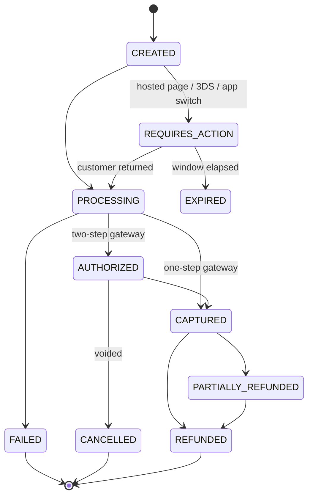

# D7 — Payment Architecture

Provider-independent by construction: nothing outside
`infrastructure/payment/adapters/` may name a gateway. Adding Nagad is a seed
row plus one class — never a schema change, never a branch in a resolver.

## The port

```ts
// modules/payments/domain/ports/payment-gateway.port.ts
export interface PaymentGatewayPort {
  readonly kind: PaymentProviderKind;
  readonly capabilities: ReadonlySet<PaymentCapability>;

  createCharge(cmd: CreateChargeCommand): Promise<ChargeResult>;
  capture?(cmd: CaptureCommand): Promise<ChargeResult>;   // two-step gateways
  void?(cmd: VoidCommand): Promise<ChargeResult>;
  refund(cmd: RefundCommand): Promise<RefundResult>;
  /** Verify signature + parse. NEVER trusts the body. */
  parseWebhook(raw: RawWebhook): Promise<WebhookEvent>;
  /** Ask the provider what actually happened — reconciliation. */
  syncStatus(providerRef: string): Promise<ChargeResult>;
  tokenize?(cmd: TokenizeCommand): Promise<InstrumentToken>;
}
```

Everything a gateway can differ on is expressed as **data**, not code:
`PaymentProvider.capabilities` (does it do partial refunds? tokenisation?
three-DS?), `countryCodes`, `currencies`, `priority`, `feeRate`. The
`PaymentRouter` picks an adapter from those columns:

```
router.select({ countryCode, currency, method, amount })
  → providers where isEnabled
      ∧ (countryCodes empty ∨ contains countryCode)
      ∧ (currencies empty ∨ contains currency)
      ∧ supports(method)
  → order by priority
  → first, with the rest kept as the failover chain
```

Adapters, one file each: `StripeAdapter`, `SslCommerzAdapter`, `BkashAdapter`,
`NagadAdapter`, `RocketAdapter`, `PaypalAdapter`, `ApplePayAdapter`,
`GooglePayAdapter`, plus `CashAdapter` and `WalletAdapter` — cash and wallet
implement the same port, which is what keeps the order flow free of
`if (method === 'cash')`.

Provider quirks are absorbed inside the adapter, where they belong: Apple Pay
and Google Pay are *instruments* presented through Stripe rather than
independent gateways; bKash needs a grant token refreshed on a timer; SSLCommerz
posts a form and returns via IPN with a `val_id` that must be re-validated
server-side; Nagad requires an RSA-signed payload. None of that reaches the
`payments` module's application layer.

## Intent lifecycle



**A retry is a new `PaymentIntent`, not a mutated one.** That is what makes
"Payment Retry" a listable history — three declines and a success are four rows
with four provider references, which is exactly what a support agent needs and
what a mutated status column destroys.

`Order.paymentStatus` is the projection the frontend reads (`pending | paid |
failed | refunded`), derived from the intents: paid if any is `CAPTURED`,
refunded once refunds cover the capture, failed if the latest failed and none
succeeded.

## Placing an order

```mermaid
sequenceDiagram
  participant C as Client
  participant O as OrdersModule
  participant P as PaymentsModule
  participant G as Gateway
  participant Q as BullMQ

  C->>O: placeOrder(input, Idempotency-Key)
  O->>O: revalidate cart server-side<br/>(prices, availability, min order, coupon, tax)
  O->>O: TX: create Order (placed) + items + OrderEvent + reserve stock<br/>+ OutboxEvent(order.placed)
  O-->>C: OrderPayload { order, paymentRequired }

  alt cash
    P->>P: intent(CASH) → CAPTURED at delivery, not now
  else wallet
    P->>P: TX: debit Wallet + WalletTransaction + LedgerEntry ×2
  else gateway
    C->>P: authorisePayment(orderId, method)
    P->>G: createCharge
    G-->>P: providerRef (+ redirectUrl if action needed)
    P-->>C: PaymentPayload { status, redirectUrl }
    C->>G: hosted page / app switch
    G-->>P: webhook  (async, authoritative)
  end

  P->>Q: enqueue payment.reconcile (delay 2m, then backoff)
  Note over P,Q: the webhook usually lands first;<br/>reconciliation is the safety net, not the happy path
```

Two rules make this safe:

- **The client never reports success.** A redirect return marks the intent
  `PROCESSING` at most; only a verified webhook or a `syncStatus` poll moves it
  to `CAPTURED`. A client that says "I paid" is a claim, not evidence.
- **Idempotency-Key on `placeOrder`.** The `IdempotencyKey` table stores the
  first response; a retry (double-tap, flaky network, browser back) returns it
  verbatim instead of creating a second order.

## Webhooks

Every callback is **persisted before it is processed**:

```
POST /webhooks/payments/:provider
  1. read the raw body (before any JSON parsing — signatures cover bytes)
  2. INSERT PaymentWebhookEvent (status=received)   ← survives a crash from here on
  3. verify the signature via the adapter → status=verified | invalid
  4. dedupe on (providerId, eventId) — a unique violation means "already seen", return 200
  5. enqueue payment.webhook.process
  6. return 200 immediately
```

Returning 200 fast matters: providers retry aggressively on a slow response and
a synchronous handler turns one event into five. Processing is a worker, with
`attempts: 8` and exponential backoff, then the DLQ and an alert.

Unmatched events (a `providerRef` we have never seen) are kept, not discarded —
they are usually a test-mode key or a race with intent creation, and both are
diagnosable only if the row exists.

## Refunds

`RefundRequest` (a claim, which can be rejected) is deliberately separate from
`Refund` (money moving, which can be partial and can fail):

```
RefundRequest  requested → approved → n × Refund
                        ↘ rejected
Refund         pending → processing → succeeded | failed
```

- **Partial** — several `Refund` rows per intent; the write path asserts
  `Σ amount ≤ intent.capturedAmount` inside the transaction.
- **To wallet** — instant, no gateway, a `WalletTransaction` plus two
  `LedgerEntry` rows. Offered first because it costs nothing and lands
  immediately; the customer may still insist on the original method.
- **Cash orders** refund to wallet or by adjustment; there is no card to credit.
- **Auto-refund** on a cancellation after capture, driven by the order machine
  via the outbox, so a cancelled-and-paid order cannot end up quietly unrefunded.
- Every refund writes ledger entries reversing the original legs, so
  vendor payables and platform revenue stay correct without a second reconciliation.

## Money movement — the ledger

Every money event is double-entry, and the write path asserts the legs sum to
zero before committing.

An order of ৳1000 (৳50 delivery, ৳50 VAT, 15% commission on the ৳900 food):

| Account | Amount |
| --- | ---: |
| `PLATFORM_CASH` | +1000.00 |
| `VENDOR_PAYABLE` (vendor) | −815.00 |
| `PLATFORM_REVENUE` (commission) | −135.00 |
| `TAX_PAYABLE` | −50.00 |
| **Σ** | **0.00** |

Cash-on-delivery instead credits `RIDER_CASH_HELD`, so the rider's debt to the
platform is a ledger fact rather than a derived guess — which is what makes the
zone cash limit enforceable and remittance reconcilable.

`Wallet.balance`, `LedgerAccount.balance` and rider balances are maintained
projections; a nightly job re-sums the entries and alerts on any drift. A
projection that is never checked is a projection that is eventually wrong.

## Payment status sync

Three independent mechanisms, because webhooks alone are not reliable:

1. **Webhook** — the fast path.
2. **Scheduled reconciliation** — every non-terminal intent older than 2 minutes
   is polled via `syncStatus`, with backoff up to 24 h. Catches lost webhooks.
3. **Daily settlement import** — the provider's settlement file is the arbiter
   for fees and for anything the other two missed; discrepancies raise an
   operations task rather than silently correcting themselves.

## Failure and retry

| Failure | Response |
| --- | --- |
| Network timeout to gateway | retry 3× with jitter; then `syncStatus` before ever retrying the charge, so a double charge is impossible |
| Declined (insufficient funds, limits) | terminal for that intent; the frontend offers another method |
| 3DS abandoned | expires after 15 min; the order stays `placed` and unpaid |
| Provider outage | circuit breaker opens after 5 consecutive 5xx; router fails over to the next provider by priority |
| Webhook signature invalid | stored as `invalid`, alerted, never processed |
| Duplicate webhook | unique violation on `(providerId, eventId)` → 200, no-op |

## Vendor settlement

`Payout` per vendor per period: gross sales − commission − refunds − chargebacks
+ cash already collected by the vendor. Generated by a scheduled job from ledger
entries, never from a scan of orders, so it reconciles by construction.
`PayoutAccount` holds only masked details; the real credentials live in the
secret manager behind `secretRef`.

Riders settle on the same machinery through `RiderWithdrawal`, gated on the
zone's `minWithdrawal` and blocked while `cashInHand` exceeds `cashLimit` — you
cannot withdraw earnings while holding the platform's cash.

## Security

- **PCI scope stays SAQ-A.** No PAN ever reaches the API. Card data goes
  browser → gateway via the gateway's own element/SDK; we store a token, a
  brand and four digits.
- Provider secrets are referenced by name (`credentialRefs`) and resolved from
  AWS Secrets Manager / Vault at boot. A database dump contains no key.
- Webhook endpoints are IP-allowlisted where the provider publishes ranges, and
  signature-verified in every case.
- `PaymentTransaction.rawPayload` is redacted by the adapter before storage.
- Amounts are **never** taken from the client. The server re-prices the cart at
  `placeOrder`; a client-supplied total is ignored, not validated.
- Every payment mutation is audited with actor, IP and request id.
