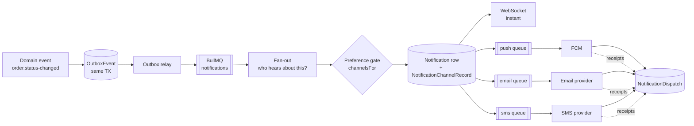

# D8 — Notification Architecture

The C25 model is already correct and is kept whole: **a notification is a key
plus data, never a sentence**; the subject is a typed reference, not an
`orderId` column; and channels are decided once, at emit, and recorded.

What the backend adds is real delivery, a template catalogue, and an outbox that
survives a crash.

## Pipeline



Every stage is a queue boundary, so a dead SMS provider delays SMS and nothing
else. The emit itself is transactional: the `OutboxEvent` is written in the same
transaction as the state change, so an order that was accepted can never fail to
notify, and a rolled-back acceptance can never notify by mistake.

## Fan-out

One event reaches several inboxes. The tables in `lib/notifications.ts` port
across directly — they are already the right shape:

| Event | customer | restaurant | rider | admin |
| --- | :-: | :-: | :-: | :-: |
| `order.placed` | ✓ | ✓ | | |
| `order.confirmed` | ✓ | | | |
| `order.ready` | ✓ | | ✓ | |
| `order.rider-assigned` | ✓ | ✓ | ✓ | |
| `order.arrived` | ✓ (OTP) | | | |
| `order.delivered` | ✓ | ✓ | ✓ | |
| `order.rejected` / `cancelled` | ✓ | ✓ | ✓* | ✓ |
| `payment.failed` | ✓ | | | ✓ |
| `refund.approved` | ✓ | ✓ | | |
| `review.created` | | ✓ | | |
| `review.replied` | ✓ | | | |
| `reservation.*` | ✓ | ✓ | | |
| `subscription.renewed` / `.failed` | ✓ | ✓ | | ✓ (failed) |
| `quote.quoted` | ✓ | ✓ | | |
| `job.offered` | | | ✓ | |
| `rider.cash-limit` | | | ✓ | ✓ |
| `inventory.low-stock` | | ✓ | | |
| `coupon.granted` | ✓ | | | |

\* only the assigned rider.

## The preference gate

One function decides channels, once, at emit — `channelsFor(template, user)`:

```
inApp   always (it IS the record)
push    template allows ∧ (required ∨ pref.push) ∧ device has a token
email   template allows ∧ (required ∨ pref.email) ∧ email verified
sms     template allows ∧ (required ∨ pref.sms) ∧ phone verified
```

`NotificationTemplate.isRequired` marks what cannot be switched off — an order
cancellation, a failed payment, a security alert. Everything else obeys
`NotificationPreference`, whose defaults match C28 (promotions off).

A suppressed channel still writes a `NotificationDispatch` row with
`status: suppressed` and a reason key. That is what makes the matrix legible:
"why didn't I get an email" is answered by a row, not by silence.

## Channels

**In-app** — the `Notification` row itself, delivered live over WebSocket to
`user:<id>` and read back through `notificationFeed`. Unread counts are a Redis
counter invalidated on read, because a `COUNT(*)` per page load on a growing
inbox is the wrong shape.

**Push (FCM)** — `Device.pushToken`, multicast per user (all their devices).
`data`-only messages so the service worker renders the notification in the
device's current locale from `key` + `params`, rather than baking English into
the payload. `UNREGISTERED` / `INVALID_ARGUMENT` responses clear the token —
otherwise the invalid-token rate climbs until FCM throttles the sender. Web push
uses VAPID with the same payload shape.

**Email** — MJML templates compiled per locale, `key` → subject/body from the
message catalogue. Per-user daily cap on non-required mail. Bounces and
complaints are ingested from the provider's webhook and mark the address
undeliverable, because continuing to send to a hard bounce is how a sending
domain gets blocked.

**SMS** — the most expensive channel, so the narrowest: OTP, delivery-arrived,
and order-cancelled. Provider chosen per country from `Setting`
(`sms.provider.<country>`), sender ids registered per market, and a
hard per-user daily cap.

## Templates

`NotificationTemplate` is a row, not code: `key`, `audience`, `category`,
`tone`, allowed `channels`, `isRequired`, the governing preference `topic`,
provider template ids per channel, and the `hrefPattern` for the deep link.
Adding a notification is a seed row plus catalogue entries in
`messages/{en,bn,ar}.json`.

The rendering rule is the C24 one, unchanged: the message catalogue is the
source of prose, `params` are interpolated at read time, and the *only* literal
text stored on a row is an operator's broadcast (`Notification.text`), because
prose a human typed in one language is not a catalogue entry and pretending
otherwise would produce a mistranslated broadcast.

## Broadcasts

`NotificationSegment` holds the rule; the size is **derived at send time**, never
stored. `sendBroadcast` resolves the segment, then fans out in batches of 500
through the queue so a million-recipient campaign is not one transaction.
`NotificationCampaign.results` records per-channel sent/suppressed counts.

`BroadcastKind` is the one decision the platform cannot make: `promotion`
(suppressible, and suppressed by default) versus `announcement` (obligatory).
That single field is what keeps an operator from accidentally spamming everyone
who opted out.

## Delivery receipts

`NotificationDispatch` moves `queued → sent → delivered | failed | bounced`.
Provider webhooks (FCM delivery receipts, email opens/bounces, SMS DLRs) update
the row by `providerRef`. Retry is 3 attempts with backoff for transient
failures only — a hard bounce or an unregistered token is terminal and clears
the destination instead.

## Real-time coupling

Push and WebSocket are complementary, not alternatives: WS is instant while the
app is open, push reaches a closed app. Both fire; the client dedupes on
`notification.id`, which is why the id is minted before either is sent.

## Ordering and idempotency

`OutboxEvent` carries the aggregate id, and the notification worker keys on
`(aggregateId, eventName, aggregateVersion)`. A replayed outbox row therefore
cannot produce a duplicate notification. Per-order events are processed on a
BullMQ FIFO group keyed by `orderId`, so "preparing" cannot overtake "confirmed"
in a customer's inbox — an out-of-order status trail is worse than a late one.

## Quiet hours

Non-required push and SMS are held between 22:00 and 08:00 **in the recipient's
timezone** (`User.timezone`, falling back to the country's) and released in the
morning. Required notifications ignore quiet hours entirely: an order being
cancelled at 23:00 is worth waking someone for.
