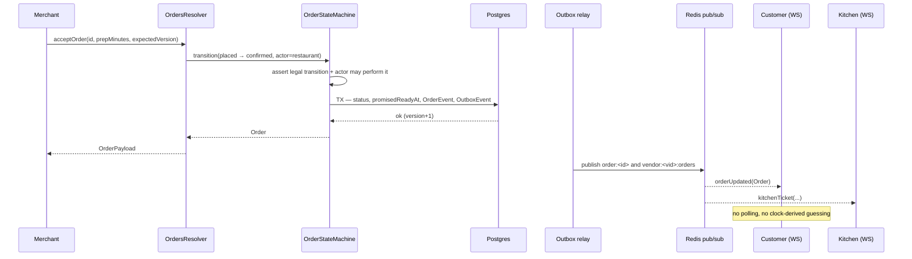

# D9 — Real-time Architecture

Phase C fakes live progress by deriving status from the clock
(`lib/order-sim.ts`, `lib/tracking.ts`, `lib/qr.ts`). That was the right call
without a server, and it is exactly what the backend replaces: the same screens
keep their shapes, but the state now comes from what actually happened.

## Transport

Two channels, chosen per use case rather than by preference:

| Transport | Used for | Why |
| --- | --- | --- |
| **GraphQL subscriptions** (`graphql-ws`) | everything typed and schema-bound — order updates, kitchen tickets, job offers, notifications | one schema, one auth path, codegen'd client types |
| **Socket.IO namespace** | high-frequency rider location and presence/typing | binary-ish volume and per-room broadcast without a GraphQL execution per event |

Both sit behind the same `RealtimeGateway` auth and room model, and both fan out
across pods through **Redis pub/sub** — `graphql-redis-subscriptions` for the
first, `@socket.io/redis-adapter` for the second. Any pod may publish; every
pod's subscribers receive. That is what makes horizontal scaling a config
change rather than a rewrite.

## Rooms

Namespacing is the authorization surface, so it is explicit:

```
order:<orderId>              customer + assigned rider + vendor staff
vendor:<vendorId>:orders     merchant dashboard / kitchen board
vendor:<vendorId>:floor      reservations + dine-in service calls
branch:<branchId>:kds        kitchen display
rider:<riderId>              that rider only
zone:<zoneId>:dispatch       admin dispatch console
user:<userId>                notification bell, wallet
session:<sessionId>          QR dine-in sitting (guest, no account)
admin:ops                    live ops board
```

Authorization runs **twice**: once on `connection_init` (token in the payload,
never in the URL — URLs land in proxy logs), and again on every `subscribe`,
checking the actor against the room. A customer subscribing to
`order:<someone else's>` is rejected at subscribe time, not when the first event
would have leaked.

Connections carry a heartbeat (25 s ping, 60 s timeout) and are dropped on token
expiry; the client re-authenticates through the normal refresh flow and
resubscribes.

## Live order status

The order machine is the single writer. Every transition, wherever it comes
from — merchant tap, rider action, scheduler, admin override — goes through
`OrderStateMachine.transition()`, which in one transaction writes the status,
appends the `OrderEvent`, and enqueues an `OutboxEvent`. The relay then
publishes to the rooms and the notification pipeline.



Legal transitions are ported verbatim from `lib/order-machine.ts` so both sides
agree, and the machine additionally enforces *who* may make each move — a
customer cannot mark an order `ready`, a rider cannot `confirm` it.

**Reconnection.** A client that drops resubscribes with the last event id it
saw; the resolver replays `OrderEvent` rows after that id before streaming live.
Missing a transition while the tunnel flapped would leave a tracker permanently
stale, and the append-only log is what makes replay possible at all.

**Scheduled transitions** (an order past its promised time, an unaccepted order
past the auto-reject window, an offer that lapsed) are BullMQ delayed jobs, not
a polling sweeper. They call the same machine, so a timeout produces the same
event a human would have.

## Kitchen status

`branch:<id>:kds` streams tickets with the fields a kitchen actually needs:
elapsed since accept, remaining against `promisedReadyAt`, item lines, and
allergen flags. Three states drive the colour — on time, at risk (< 5 min),
late — computed server-side from the promise, so two screens in the same
kitchen cannot disagree about whether a ticket is late.

Bump actions (`start`, `ready`) are the same order transitions, which is the
point: a KDS is a view of the order machine, not a parallel system with its own
state.

## Rider tracking

The volume case, and the one that would break if treated like everything else.

```
rider app ──5s──► Socket.IO pushLocation
                    │
                    ├─► Redis GEO  riders:zone:<id>       (live position, TTL 60s)
                    ├─► Redis      rider:<id>:last        (hot read for the tracker)
                    ├─► broadcast  order:<id> riderLocation
                    └─► buffered ──60s──► RiderLocationPing (batch insert)
```

- **Redis is the live position**; Postgres is the audit trail. Writing a row per
  ping per rider would be thousands of inserts a second for a fact that is stale
  in five seconds.
- Pings are **buffered and batch-inserted** every 60 s, and only while a job is
  active. Off-shift riders are not tracked — that is a privacy line, not an
  optimisation.
- Positions are **throttled and smoothed** before broadcast (drop < 15 m moves,
  clamp implausible speeds), so the marker does not jitter on GPS noise.
- The customer sees the rider only between `rider-assigned` and `delivered`,
  and only for their own order.
- ETA is recomputed on each broadcast from remaining route distance, the zone's
  average speed for the hour, and the rider's recent pace — not from a fixed
  countdown.

`rider_location_pings` is monthly-partitioned and pruned at 30 days; route
replay for a dispute reads the partition, not the live path.

## Restaurant dashboard

`vendor:<id>:orders` carries incremental deltas, never a full refetch: new
order, status change, a counter delta for the KPI cards. The dashboard applies
them to its cache, so a busy Friday does not re-run the stats query on every
event. A `dashboardStats` snapshot is pushed every 30 s as a correction, which
bounds any drift from a missed delta.

Reservations and dine-in share the venue's `floor` room, so a waiter call, a new
booking and a seated party all arrive on one connection.

## Live analytics

Counters are incremented in Redis on the same events that write to Postgres
(`orders:today:<vendorId>`, `revenue:today:<vendorId>`), and pushed to the
`admin:ops` and vendor rooms every 5 s. Postgres remains the source of truth and
a scheduled job re-derives the counters hourly; the Redis values are a display
cache with a known reconciliation, not a second ledger.

Anything heavier than a counter — funnels, heatmaps, cohort retention — is a
materialised view refreshed on a schedule, queried normally. Real-time is
reserved for what genuinely changes minute to minute.

## Chat, presence, typing

Support and order chat (`order:<id>`, `support:<ticketId>`): messages persist
before broadcast, so history survives a reconnect and the room is replayable.

Presence and typing are **Redis-only, deliberately**. `presence:<room>` is a
sorted set of `(actorId → lastSeen)` with a 30 s TTL, refreshed by heartbeat;
typing is a 3 s key. Neither is ever written to Postgres — they are worthless
one second later, and persisting them would add write load for data nobody can
read.

## Scaling and failure

- Pods are stateless; the Redis adapter carries fan-out. Sticky sessions are
  only needed for the Socket.IO handshake and are provided by the ingress.
- Per-connection subscription caps (20) and a per-IP connection cap stop one
  client from exhausting a pod's sockets.
- **The WebSocket is an accelerator, never the only path.** Every subscription
  has a query behind it, and the client falls back to polling on repeated
  connection failure. A customer whose corporate proxy blocks WS still sees
  their order progress.
- Redis pub/sub is fire-and-forget by design; anything that must not be lost
  goes through the outbox and BullMQ instead. Nothing important is delivered
  *only* over pub/sub.
